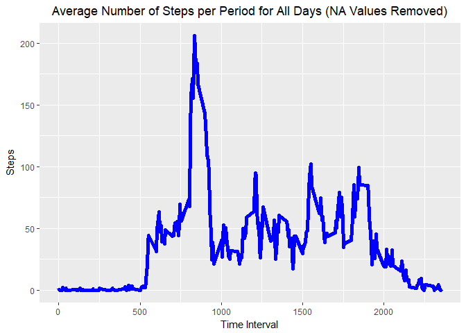
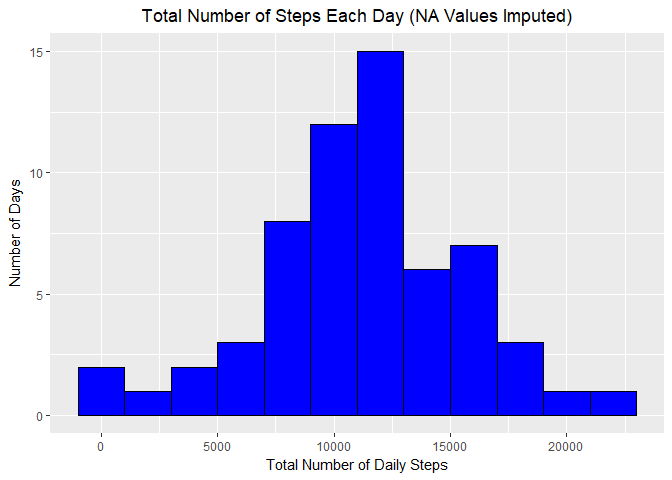

# Reproducible Research - Project 1
Weston Carloss  
Due:  April 23, 2017  
***  


##  Investigation of Daily Physical activity  
***  
The recent popularity of personal activity monitors such as Fitbit, Nike 
Fuelband, Jawbone Up, and many more has created large amounts of data measuring 
different parameters of the users' physical activity. Some users analyze their 
data with the intention of using it to encourage more exercise, while others 
simply want to identity patterns of activity for general curiosity.  This 
project analyzes the number of steps taken by a single user in order to look for
trends throughout the day, over the course of a month, and weekdays versus 
weekends.  The data was collected at 5 minute intervals every day from October 1, 
2012 through November 30, 2012.  

There are 3 variables in the original dataset:  

*   **steps** - number of steps taken during the time period indicated by 
    **date** and **interval**  

*   **date** - calendar date the data was taken  

*   **interval** - minute number that the data was taken (0 - 2355 for each day)  
  
  
###  1.  Total Steps Taken Daily  
***  
The first part of this analysis calculates the total number of steps taken each 
day and evaluates whether this is relatively consitent over the two month 
measurement period.
  
To begin the analysis we first need to download the data and load it into R 
using the code below.

```r
##  Download the zip file and extract the contents
if(!file.exists("./data")) {dir.create("./data")}
ZipUrl <- "https://github.com/droogdim83/RepData_PeerAssessment1/raw/master/activity.zip"
if(!file.exists("activity.zip")) {
    download.file(ZipUrl, dest="./data/activity.zip") 
}
unzip ("./data/activity.zip")

##  Read in the data
activity <- read.csv("./activity.csv", header = TRUE, stringsAsFactors = FALSE)
```
  
The data contains eight days with entirely *NA* values. These NA values could 
indicate that the device was powered down or had a malfunction, either of which 
would prevent the activity monitor from collecting data. These *NA* values will
cause errors in many functions, so we'll split the data into "complete samples"
which have a numeric value for **steps**, and "incomplete samples" which have an
*NA* value for **steps**.  

Additionally, we want to determine the day of the week (Monday, Tuesday, 
Wednesday, etc) for each data. This will be combined with the **interval** 
value to give a unique identifier that will be used in later analysis.  

```r
##  Convert date column from "character" to "date" and add a day Of Week column
activity$date <- as.Date(activity$date, "%Y-%m-%d")
activity$dayOfWeek <- weekdays(activity$date)
activity$int.day <- paste(activity$interval, activity$dayOfWeek, sep = ".")

##  Split data into steps = NA and steps != NA
activityMinusNA <- activity[!is.na(activity$steps), ]
activityAllNA <- activity[is.na(activity$steps), ]
```
  
Now we can begin our analysis by calculating the total number of steps taken 
each day and plotting how this number varies over the 2-month measurement 
period. The plot shows that the user walked **9,000 - 13,000** steps daily 
almost half (45%) of the days. The user walked **7,000 - 15,000** steps daily 
for 70% of the days.  

```r
##  Calculate Total Number of Steps per Day
totalStepsDay <- aggregate(steps ~ date, activityMinusNA, FUN = sum)

##  Make a histogram of the total number of steps taken each day
library(ggplot2) 
library(scales)

stepsHist <- ggplot(data = totalStepsDay, aes(steps)) + 
    theme_update(plot.title = element_text(hjust = 0.5)) +
    geom_histogram(binwidth = 2000, color = "black", fill = "green") + 
    xlab("Total Number of Daily Steps") + ylab("Number of Days") + 
    ggtitle("Total Number of Steps Each Day (NA Values Removed)") +
    scale_y_continuous(breaks= pretty_breaks()) +
    theme_update(plot.title = element_text(hjust = 0.5)) 
print(stepsHist)
```

<!-- -->
  
We can also look at the mean and median number of days steps. Both the **mean** 
and **median** are over **10,750 steps per day**. The mean and median value are 
nearly identical, which isn't too surprising based on the fairly symmetric 
distribution.

```r
meanTotalSteps <- mean(totalStepsDay$steps)
print(meanTotalSteps)
```

```
## [1] 10766.19
```

```r
medianTotalSteps <- median(totalStepsDay$steps)
print(medianTotalSteps)
```

```
## [1] 10765
```
  
  
###  2.  Average Daily Activity Pattern  
***  
This portion of the study looks at the average level of activity (steps) during 
each interval of the day, averaged across all days. The daily activity can be 
split into around 5 major sections:  

1.  The plot shows essentially zero activity early in the day (low interval 
values), which likely corresponds to sleeping.  

2.  This is followed by a sudden increase up to a moderate level of 
activity. The user was likely getting ready for the day during this time.  

3.  Immediately following this is a huge increase in activity, which might 
correspond to a morning run or walking/running to work or school. The peak 
activity levels occur during this time (approximately intervals **800 - 900**).  

4.  The next period, from intervals **950 - 1900**, shows much lower levels of 
activity with brief spikes. These spikes are much lower than the daily highs 
in section 3. The spikes could possibly correspond to events like lunch time, 
leaving work/school, and cooking or some other nightly activity.  

5.  Finally, the activity slowly tapers back down to nearly zero. The reduced 
activity is likely a sign of the user preparing for bed.  


```r
##  Calculate the average number of steps per time period across all days
avgStepsInt <- aggregate(steps ~ interval, activityMinusNA, FUN = mean)

##  Make a time series plot of average number of steps per interval
avgStepsVsInt <- ggplot(avgStepsInt, aes(interval, steps)) + 
    theme_update(plot.title = element_text(hjust = 0.5)) 
avgStepsVsInt + geom_line(color = "blue", size = 2) + xlab("Time Interval") +
    ylab("Steps") + theme_update(plot.title = element_text(hjust = 0.5)) +
    ggtitle("Average Number of Steps per Period for All Days (NA Values Removed)")
```

<!-- -->
  
As we can see below, the peak level of activity occurs a little over a third of 
the way through the day, during interval 835. This would correspond to around 
8:40am which agrees with the earlier hypotheses of an earlier morning walk/run 
or walking/running to work or school.

```r
##  Determine Which time interval has most daily activity
mostActiveIndex <- as.numeric(which.max(avgStepsInt$steps))
mostActiveInt <- avgStepsInt[mostActiveIndex, 1]
print(mostActiveInt)
```

```
## [1] 835
```
  
  
###  3.  Imputing Missing Values  
***  
As stated in Section 1, the original data contains 8 days which were all NA 
values (2304 values total, as shown below). The earlier calculations and 
related plots were created by removing all NA values. Instead of simply 
removing all the values, another option is to replace the NA values with 
numeric values. This process is called imputation. Obviously, this isn't as 
accurate as having real numbers to begin with, but it increases the sample size 
and may give us a better idea of the "true" activity, depending on how the data 
is imputed.  

```r
##  Calculate the total number of missing values in the dataset
totalNA <- as.numeric(sum(is.na(activity$steps)))
print(totalNA)
```

```
## [1] 2304
```

In general, most people have daily routines, especially during the week.  Here 
are some examples:  

* An employed person may have a two-hour meeting every Monday starting at 10am.  

* A student may have a class from 1 - 2:30 every Tuesday and Thursday.  

* An employed person or a student may go to the gym during lunch Monday, 
Wednesday, and Friday.  
  
Based on this idea, I've chosen to impute the NA values by determining the 
average number of steps during each interval for each day of the week.  The 
values are then randomly generated using a normal distribution.  The mean and 
standard deviation for the normal distribution are calculated from the dataset 
with the NAs removed.  Because the average number of steps may be nearly zero 
during some periods, negative values could be generated by the random normal 
distribution.  Negative step values are obviously illogical, so these values 
are simply replaced with a zero.  

```r
avgStepsIntDay <- aggregate(steps ~ interval + dayOfWeek, activityMinusNA, 
                            FUN = mean)
sdStepsIntDay <- aggregate(steps ~ interval + dayOfWeek, activityMinusNA, 
                           FUN = sd)

set.seed(12345)
imputedSteps <- rnorm(n = length(avgStepsIntDay$steps), 
                      mean = avgStepsIntDay$steps, sd = sdStepsIntDay$steps)
##  Corrects for illogical negative step values that may be generated
imputedSteps[imputedSteps < 0] <- 0 
```

By combining the subset with the imputed values with the original, complete 
subset, we can create a new, complete version of the original data set.  This 
new dataset contains 61 days of data, compared to 53 days in the dataset used 
in sections 1 - 3.  

```r
##  Create a new dataset that's equal to the original, with NAs filled in
imputed <- subset(avgStepsIntDay, select = c(interval, dayOfWeek))
imputed$steps <- imputedSteps
imputed$int.day <- paste(imputed$interval, imputed$dayOfWeek, sep = ".")

##      Match by "int.day" and replace "NA" steps with imputed steps
activityAllNA$steps <- imputed$steps[match(activityAllNA$int.day, imputed$int.day)]
activityWithImputed <- rbind(activityMinusNA, activityAllNA)

##      Re-sort by Date then Interval
library(plyr)
activityWithImputed <- arrange(activityWithImputed, date, interval)
```

In this new dataset with 61 days, the imputed values are near the mean. This 
leads to proportionally more days where the activity is close to the mean. This 
should counteract some of the downward pull of low activity outliers, resulting 
in a higher overall mean activity level. We can verify this intuition by 
creating a histogram of the new dataset, and calculating the mean and median 
values for this same dataset.  

As seen below, there are more days with activity levels near the mean. In 
addition, the **mean increased from 10,766 to 11,238**. The **median** has 
similarly **increased from 10,765 to 11,352**. Notice that the mean and 
median in the new dataset are farther apart. This is a result of generating a 
random normal sample for a small number of days, only 8. Even though the values 
were generated from a normal distribution, the data is only gauranteed to mimic 
this distribution with a large number of samples.  

```r
##  Make a histogram of the total number of steps taken each day.
totalStepsDayImputed <- aggregate(steps ~ date, activityWithImputed, FUN = sum)

library(ggplot2) 
library(scales)

stepsHistImpute <- ggplot(data = totalStepsDayImputed, aes(steps)) + 
    theme_update(plot.title = element_text(hjust = 0.5)) +
    geom_histogram(binwidth = 2000, color = "black", fill = "blue") + 
    xlab("Total Number of Daily Steps") + ylab("Number of Days") + 
    ggtitle("Total Number of Steps Each Day (NA Values Imputed)") +
    scale_y_continuous(breaks= pretty_breaks())
print(stepsHistImpute)
```

<!-- -->

```r
##  Calculate the mean and median number of total steps per day
meanTotalStepsImpute <- mean(totalStepsDayImputed$steps)
print(meanTotalStepsImpute)
```

```
## [1] 11237.95
```

```r
medianTotalStepsImpute <- median(totalStepsDayImputed$steps)
print(medianTotalStepsImpute)
```

```
## [1] 11352
```

As explained above, the differences in the distribution of daily activity, the 
mean activity level, and median activity levels are due to the way the missing 
values were imputed. As an example, the missing values could have been 
replaced with the lowest activity level from the 53 day dataset. This would 
have skewed the distribution left, and decreased the mean and median values.  
  
  
###  4.  Comparing Weekday and Weekend Activity Patterns  
***  
The final section of this analysis compares and contrasts the activty patterns 
during weekdays and weekends.  In general, most people sleep in on the weekends
and stay up later.  The weekends probably have fewer regularly scheduled events 
(classes or work breaks) and more erratic acitivties levels compared to the 
weekdays. 

```r
##  Create a factor variable identifying each day as "weekday" or "weekend"
activityWithImputed$weekdayID <- rep(" ", times = length(activityWithImputed$steps))

weekdayList <- c("Monday", "Tuesday", "Wednesday", "Thursday", "Friday")
weekendList <- c("Saturday", "Sunday")

activityWithImputed[activityWithImputed$dayOfWeek %in% weekdayList, 
                    "weekdayID"] <- "weekday"
activityWithImputed[activityWithImputed$dayOfWeek %in% weekendList, 
                    "weekdayID"] <- "weekend"

##      Convert to a factor variable
activityWithImputed$weekdayID <- as.factor(activityWithImputed$weekdayID)
```
Plotting the data reveals some of these predicted features:  

1.  The weeknd shows essentially zero activity for a longer amount of time than 
the weekdays. This likely demonstrates that the user sleeps in on the weekends.  

2.  Activity once again ramps up, but the increase in activity is much less 
and slower on the weekend compared to the weekdays.  

3. Immediately following this is a sudden jump in activity, but the peak 
activity level is much less on the weekend versus the weekdays. Again, this 
probably reflects a morning walk/run. If the user works or has classes on the 
weekend, this could also be the time they are walking/running to work or 
school. The morning exercise routine is more likely.  

4. As expected, the next section, from intervals **950 - 1900** is much more 
active and erratic on the weekend compared to the weekdays.  

    +   Intervals **1200 - 1400** on the weekend show a spike in activity, which 
    might be weekend errands.  
    +   Intervals **1550 - 1750** show another surge in activity on the weeked 
    which isn't present on weekdays. This could be weekend hoursework, or more 
    exercise.  
  
5.  Finally, the user's activity slowly tapers back down toward zero. This 
slowdown starts around interval **1900 on weekdays** and **2050 on the weekend**. 
This clearly shows that the user stays awake longer on the weekend vs the 
weekdays.  
  
The second plot below shows the daily activity pattern across all days of the 
week using the full data set with the imputed values. The data is much noisier, 
making it more difficult to identity specific activity patterns. These patterns 
only become apparent when the weekdays and weekends are viewed separately.  

```r
##  Make a panel plot showing the average number of steps per interval.  
##  One panel average over weekdays, and the other averages over weekends.
avgStepsIntWeekday <- aggregate(steps ~ interval + weekdayID, activityWithImputed, 
                                FUN = mean)

WeekdayVsWeekend <- ggplot(avgStepsIntWeekday, aes(interval, steps)) + 
    theme_update(plot.title = element_text(hjust = 0.5)) +
    geom_vline(xintercept = 550, color = "red") + 
    geom_vline(xintercept = 800, color = "red") + 
    geom_vline(xintercept = 950, color = "red") + 
    geom_vline(xintercept = 1200, color = "green") + 
    geom_vline(xintercept = 1400, color = "green") + 
    geom_vline(xintercept = 1550, color = "black") + 
    geom_vline(xintercept = 1750, color = "black") + 
    geom_vline(xintercept = 1900, color = "red") + 
    geom_line(color = "blue", size = 2) + xlab("Time Interval") +
    ylab("Steps") + theme_update(plot.title = element_text(hjust = 0.5))
WeekdayVsWeekend + facet_grid(weekdayID ~ .) + 
    ggtitle("Average Number of Steps per Period for Weekdays vs Weekends")
```

<!-- -->

```r
avgStepsVsIntwithImputed <- ggplot(avgStepsIntWeekday, aes(interval, steps)) + 
    theme_update(plot.title = element_text(hjust = 0.5)) +
    geom_vline(xintercept = 550, color = "red") + 
    geom_vline(xintercept = 800, color = "red") + 
    geom_vline(xintercept = 950, color = "red") + 
    geom_vline(xintercept = 1200, color = "green") + 
    geom_vline(xintercept = 1400, color = "green") + 
    geom_vline(xintercept = 1550, color = "black") + 
    geom_vline(xintercept = 1750, color = "black") + 
    geom_vline(xintercept = 1900, color = "red") + 
    geom_line(color = "blue", size = 2) + xlab("Time Interval") +
    ylab("Steps") + theme_update(plot.title = element_text(hjust = 0.5)) + 
    ggtitle("Average Number of Steps per Period for All Days (NA Values Imputed)")
print(avgStepsVsIntwithImputed)
```

<!-- -->

##  Conclusion  
This analysis assessed the activity level of a single user which was measured 
during October 2012 and November 2012. The data was measured using an 
electronic activity monitor, such as a Fitbit. The goal of the analysis was to 
check the consistency of physical activity across the two month period, 
understand the activity trends throughout the day, and determine if these 
trends vary between weekdays and weekends.  
  
The original dataset lacked measurements for 8 full days. It's unclear whether 
the device malfunctioned on these days, or the user simply turned the monitor 
off. To address the lack of the data, the analysis was first conducted by 
removing the missing values, and then by imputing reasonable values for these 
days. The data was imputed by replacing the missing values with the average 
value for that time period on that day of the week. This imputation method was 
selected because most people have daily routines with certain events/activities 
(meetings, classes, etc) occurring at specific times on different days. Whether 
the NA values were removed or imputed, the user took **9,000 - 13,000 daily** 
**steps** approximately half the days.  
  
The daily activity levels show certain features, some of which are more visible 
when the days are split into weekdays and weekends. Regardless of whether the 
weekdays and weekends are combined or separated, there are some common features 
such as:  

*   Early morning sleep  

*   Followed by morning exercise  

*   Preparation for bed, and sleeping at the end of the day.  
  
When the weekdays and weekends are separated, we can see:  

*   The user sleeps in later on the weekend.  

*   The early morning peak activity level is lower on the weekend.  

*   The later day activity spikes are more active on the weekend.  

*   The user goes to sleep later on the weekend.  
  
Even with a limited set of variables (date, time interval, and activity level), 
we can learn a great deal about this user's activity. However, we should avoid 
extending these conclusions to a general population without sampling a much 
larger userbase over a longer period of time.  
